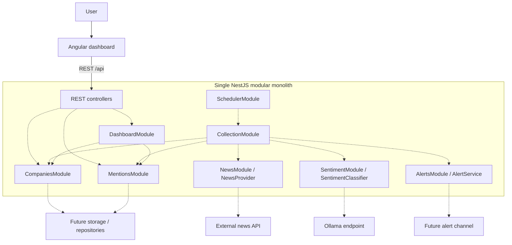
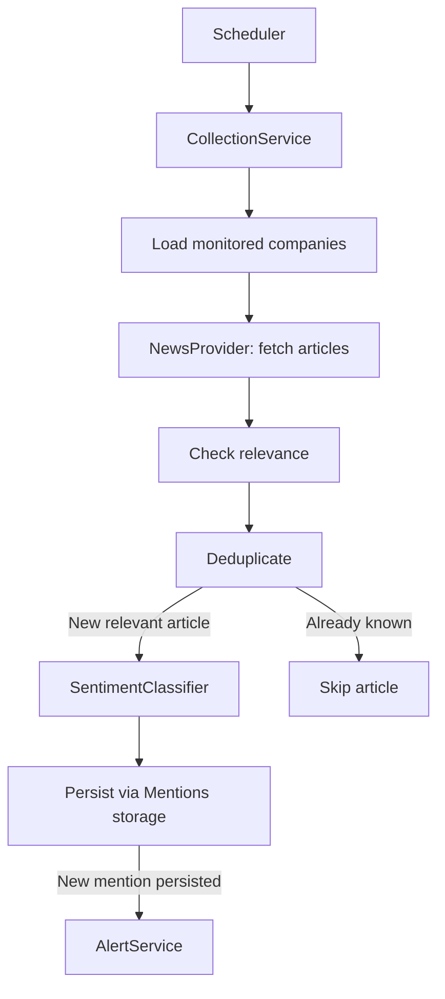

# Proposed architecture

## Modular monolith

One NestJS application keeps local development, deployment, and debugging simple. Feature modules define ownership and collaborate in process. Angular has its own build toolchain in the same npm workspace repository. There are no microservices, service discovery, distributed messaging, or separate backend deployments.

## Backend responsibilities

All eight feature modules are empty and registered in AppModule. Future services and module dependencies are documentation only.

| Module / area | Responsibility |
| --- | --- |
| CompaniesModule | Manage monitored companies and future company storage operations. |
| MentionsModule | Own discovered press mentions, persistence, and uniqueness rules. |
| NewsModule | Retrieve articles through a future NewsProvider, potentially GNewsProvider. |
| SentimentModule | Classify sentiment through a future SentimentClassifier, potentially OllamaSentimentClassifier. |
| CollectionModule | Orchestrate company lookup, fetching, relevance, deduplication, classification, and persistence. |
| SchedulerModule | Eventually trigger the daily collection process in the same application. |
| AlertsModule | Notify about newly persisted mentions through a future AlertService/channel contract. Console logs are the likely initial channel; email, Slack, or webhooks may follow. |
| DashboardModule | Expose aggregated read models through REST. |
| config | Validate PORT and select production static serving. |
| common | Reserved for concrete shared helpers when needed. |
| health | Implemented GET /api/health process-liveness endpoint, without dependency checks. |

Collection will call feature services rather than access their tables directly. Storage will be owned by Companies and Mentions; a generic base repository is unnecessary. Provider contracts and Nest injection tokens will be introduced alongside real integrations, not as unused abstractions now.

## Frontend/backend separation

Angular owns presentation, typed REST clients, and normal component state. The root route lazily loads a standalone dashboard component that shows only the title. HttpClient and router providers are registered but no requests are made. `core`, `models`, `services`, and dashboard `components` contain README explanations only. No NgRx or complex state management is introduced.

NestJS owns REST APIs and future business workflows. All API controllers use the global `/api` prefix. Health is the only endpoint. Unknown API paths must return 404 instead of Angular HTML.

## Development runtime

`npm install` then `npm run dev` starts two independent watch processes via concurrently: Angular at http://localhost:4200 and NestJS at http://localhost:3000. When either process exits, the other is terminated. The Angular proxy forwards `/api` and `/api/**` without rewriting the prefix. Future REST clients use relative `/api/...` URLs, so browser CORS configuration is unnecessary for this workflow. Changing PORT requires updating the proxy target too. NestJS does not serve Angular files in development.

## Production runtime

`npm run build` builds Angular into `frontend/dist/frontend/browser`, then NestJS into `backend/dist`. `npm run start` sets NODE_ENV=production and starts one Node process. The two build directories and installed production dependencies must be packaged together preserving these relative paths.

The browser accesses NestJS on port 3000 (or PORT). `/api/*` reaches REST controllers; `/*` serves Angular static files. ServeStaticModule is enabled only in production. `/api` and descendants are excluded from static serving. Non-API extensionless GET paths fall back to Angular's index for browser routing; missing file-like paths return 404. Startup fails clearly if the Angular production build is missing. No SSR or separate frontend production server is needed.

## Intended architecture

Everything inside the NestJS boundary is an in-process module in one application. Dashed edges indicate future dependencies, not implemented integrations. Storage is undecided and absent from code.

## Future collection sequence

This is an ordered workflow diagram, not executable code or separate services. Deduplication is a processing step, not a new module. Alerts follow successful persistence of a new mention.

## Future integration points

| Integration | Boundary | Decisions still required |
| --- | --- | --- |
| News API | NewsProvider in NewsModule | Provider, credentials, rate limits, pagination, article identity, relevance policy. |
| Ollama | OllamaSentimentClassifier in SentimentModule | Model, endpoint, hardware, timeouts, structured-response validation, failure policy. |
| Storage | Feature-owned company and mention persistence | Database, schema, migrations, unique keys, transactions. |
| Scheduler | SchedulerModule calls CollectionModule in process | Timezone, run time, overlap prevention, manual trigger, retries. |
| Alert channel | AlertsModule and a future channel contract | Console first, payload, delivery failure policy, later external channels. |

## Intentionally not implemented

No business services or endpoints, entities, database, migrations, repositories, fake responses, sample data, news API integration, relevance logic, deduplication, Ollama integration, sentiment classification, collection pipeline, scheduled tasks, alerts, or dashboard queries exist. There is no authentication, event bus, queue, Redis, Docker, Kubernetes, Nx, or complex frontend state. Runtime configuration and health are infrastructure only.

## Assumptions

The workspace was empty and no framework versions were mandated. The scaffold uses Node 24.19, Angular 22, and NestJS 11, with TypeScript scoped per workspace. Health is permitted as the sole infrastructure endpoint. The future dependencies are proposals, not finalized contracts. Production packaging preserves the backend/frontend build layout; storage and integration choices remain open.

## Next implementation steps (not performed)

1. Review assignment acceptance criteria and define company/mention fields and REST contracts.
2. Choose storage and implement monitored company management.
3. Add NewsProvider, relevance rules, and persistent deduplication.
4. Add Ollama sentiment classification with validated responses.
5. Implement the collection orchestration and failure behavior.
6. Add scheduling and alerts.
7. Build the dashboard against real data and add meaningful tests incrementally.

## Framework references

- Angular compatibility: https://angular.dev/reference/versions
- NestJS static serving: https://docs.nestjs.com/recipes/serve-static
- NestJS API prefix: https://docs.nestjs.com/faq/global-prefix
