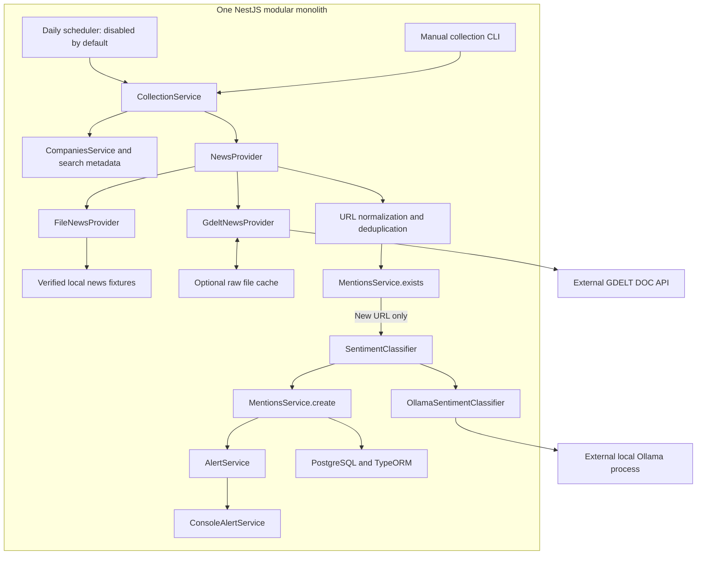
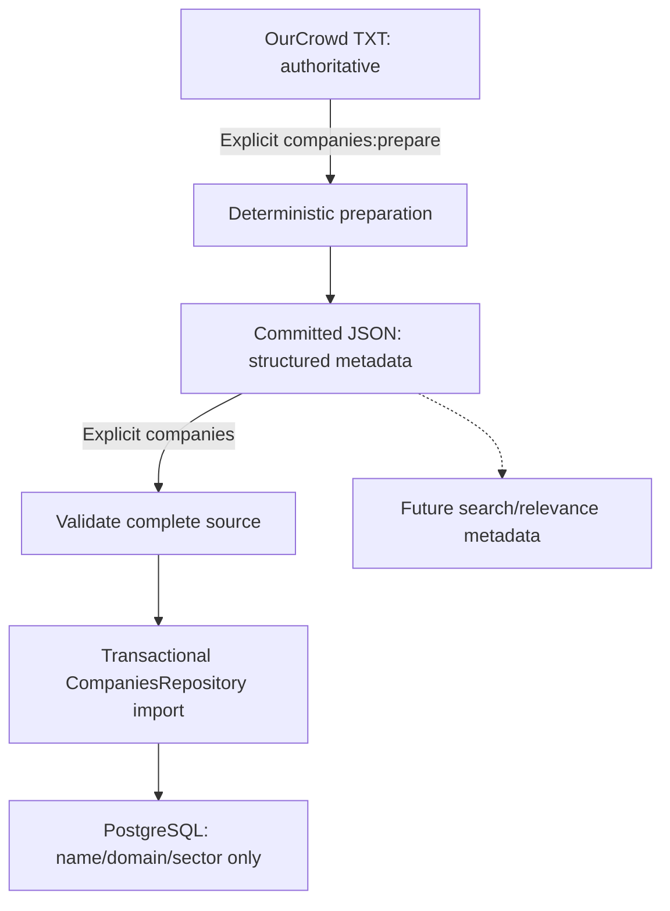
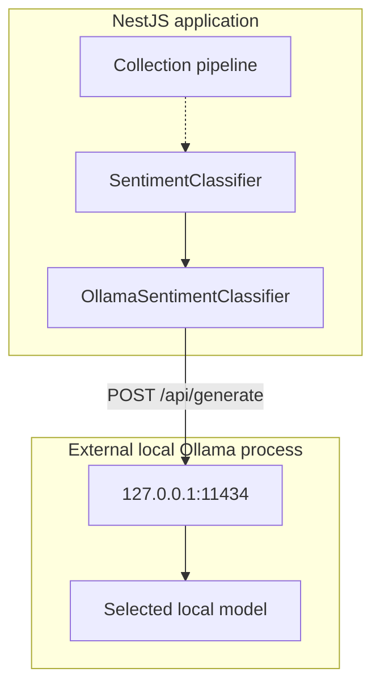

# Architecture

## Modular monolith

One NestJS application owns the REST API and all feature modules. Features collaborate in process; there are no microservices or distributed infrastructure. Angular and NestJS have independent build/watch processes in one simple npm workspace repository. The production NestJS process also serves the Angular static build.

## Feature ownership and current implementation

| Feature | Responsibility / current status |
| --- | --- |
| Companies | Company entity, feature repository/service, list and detail REST endpoints. Deterministic supplied-TXT preparation and transactional structured-JSON import with conservative exact identity matching. |
| Mentions | Mention entity, feature repository/service, read filters, existence check and internal persistence. Database uniqueness is authoritative. No external writes. |
| Dashboard | Specialized aggregate read repository, request-time derivation service and quarter-filtered REST endpoint. |
| News | NEWS_PROVIDER abstraction, GDELT DOC adapter, normalized articles, URL normalization and optional raw development cache. |
| Sentiment | SENTIMENT_CLASSIFIER contract/token, local Ollama adapter, strict response validation and isolated manual CLI. No automatic inference or database writes. |
| Collection | One sequential manual/scheduled pipeline, dedup before inference, persistence, summary and alerts. |
| Scheduler | NestJS daily scheduling, disabled by default, manual daily service and in-process overlap guard. |
| Alerts | ALERT_SERVICE contract and console delivery for newly persisted mentions only. |
| database | PostgreSQL options, explicit versioned migration, standalone initialization command. |
| common | Concrete shared date, ID and DTO validation helpers. |
| config | Standard Nest ConfigModule .env loading shared by HTTP/CLI entry points, lazy runtime settings and feature-local Ollama configuration validation. |
| health | Process-liveness endpoint, not a dependency readiness check. |

The repository-root .env is loaded with @nestjs/config; existing process environment takes precedence. TypeORM/static serving factories run after configuration loading, so database/runtime settings also work in CLI contexts. Controllers validate HTTP DTOs. Feature services handle existence, range semantics, and meaningful domain errors. Feature repositories contain TypeORM queries. CompaniesService and MentionsService are used through their exported collection boundaries; DashboardRepository is a dedicated read projection with an aggregate query, not an orchestration service. There are no generic repository base classes or framework abstractions.

## PostgreSQL persistence

PostgreSQL with TypeORM and NestJS TypeORM integration stores companies and mentions with relational constraints. The provided Docker Compose configuration keeps local database setup straightforward.

Database connections use `DB_HOST`, `DB_PORT`, `DB_USERNAME`, `DB_PASSWORD`, and `DB_DATABASE`. The working local host is `127.0.0.1` on port `5433`; PostgreSQL data is kept in the Compose volume.

`synchronize: false` is used in every mode. A versioned initial migration creates the tables, constraints and index transactionally. Pending migrations run on startup before requests are served; `npm run db:init` applies the same migrations without starting the application. TypeORM's migrations table records execution, making repeated initialization safe. This automatic startup approach is suitable for one take-home process; larger deployments would normally run migrations in a separate controlled release step. No seed data is inserted.

| Table | Fields and constraints |
| --- | --- |
| companies | id SERIAL PK; name TEXT NOT NULL with non-blank check; domain TEXT NULL; sector TEXT NULL; createdAt and updatedAt TIMESTAMP NOT NULL. |
| mentions | id SERIAL PK; companyId INTEGER NOT NULL FK to companies with delete RESTRICT; title TEXT NOT NULL; description TEXT NULL; url TEXT NOT NULL; source TEXT NOT NULL; publishedAt TIMESTAMP NOT NULL; sentiment TEXT NOT NULL restricted to POSITIVE/NEUTRAL/NEGATIVE; discoveredAt TIMESTAMP NOT NULL. |
| migrations | TypeORM migration execution history, infrastructure only. |

`UNIQUE(companyId, url)` prevents duplicates for one company while allowing an article URL to mention multiple companies. The existence check is a convenience; the database constraint also protects racing inserts. Internal duplicate creation becomes a standard ConflictException. Collection normalizes URLs before duplicate checks and persistence. An index on `(companyId, publishedAt)` supports company/time-range reads. PostgreSQL enforces the foreign-key constraint; the current unit suite does not run database integration tests.

There is no separate Article entity because the current scope only needs company-specific mentions. Additional normalization adds complexity without a current requirement.

## Derived dashboard data and date semantics

Dashboard statistics are read projections, not stored domain fields. A single left-joined aggregate query includes every tracked company, counts selected-quarter sentiments, and calculates MAX(publishedAt) across all time. The service computes elapsed whole days since that latest publication at request time. Future-dated publications yield zero rather than a negative day count. Companies with no mentions have null lastMentionedAt/null daysSinceLastMention and zero counts.

The default quarter uses the current UTC quarter. `YYYY-Q1` through `YYYY-Q4` are accepted with a four-digit, nonzero year. Quarter filters use `[start, nextQuarterStart)`, avoiding artificial end-of-day timestamps. Mention filters apply to publishedAt: date-only `from` means UTC midnight; date-only `to` includes that entire UTC day using the next midnight as an exclusive boundary. Timestamp inputs require a timezone; timestamp `to` is inclusive. Invalid calendar dates, invalid clock components, reversed ranges, invalid enums, unsafe/nonpositive IDs, repeated query values and unknown query parameters are rejected with 400. Missing companies return 404. Mentions are ordered by publishedAt descending then id descending.

## Frontend/backend and runtime modes

Angular provides the reviewer dashboard with quarter selection, summary cards, company search/activity filtering, and a company mentions drawer. Typed services use relative `/api/...` URLs and component signals. Displayed data comes from the existing REST APIs.

Development: `npm run dev` runs Angular at http://localhost:4200 and NestJS at http://localhost:3000. Angular proxies `/api` and `/api/**` without rewriting the prefix. No CORS configuration is required for this proxied browser workflow. A changed PORT requires an updated proxy target. NestJS does not serve Angular during development.

Production: `npm run build` creates `frontend/dist/frontend/browser` and `backend/dist`. `npm run start` runs one NestJS process, with `/api/*` mapped to REST and other paths to Angular static files. Static serving is production-only, excludes `/api` and descendants, and falls back to the Angular index for extensionless non-API browser routes. Missing asset/API paths return 404. Startup fails if the frontend build is missing. Package both build directories preserving their relative layout, install runtime dependencies, and configure the PostgreSQL connection and durable storage. No SSR or separate frontend production process is used.

## Implemented collection architecture

Everything inside the NestJS boundary is one modular monolith. GDELT is an external public HTTP service; Ollama is an external local process. The raw cache is a file directory, not a service. HTTP read APIs and Angular serving retain their existing boundaries; no external write APIs are exposed.

CollectionService knows only NEWS_PROVIDER, SENTIMENT_CLASSIFIER, ALERT_SERVICE and feature services. It never issues direct TypeORM queries or depends on concrete adapters. Generic collection, development collection, all-company collection and daily collection all invoke this service. News-only CLI composes CompaniesModule/NewsModule without SentimentModule or collection, allowing news verification independently.

## Collection sequencing and failure boundaries

The request uses an explicit selected scope and UTC range. Search metadata is read/validated from committed structured JSON without adding fields to Company. Primary names are used by default; one supplied expanded multiword alias can replace a 2–6-letter uppercase acronym query. Former-name aliases are excluded. No fuzzy matching or external metadata lookup; local Ollama checks article relevance during collection.

For each company, sequentially: query NewsProvider, validate normalized articles, normalize/deduplicate URLs in the response, ask MentionsService.exists, classify only new company/URL pairs, persist through MentionsService.create, collect inserted mentions. Inference concurrency is exactly one. The existing UNIQUE(companyId,url) catches races; a duplicate constraint conflict counts as skipped. Identical URLs for different companies remain valid. Existing rows are not retroactively normalized/reclassified.

URL normalization trims, removes fragments and known tracking keys (utm_source/medium/campaign/term/content, fbclid, gclid), and canonicalizes hostname casing with URL. Other query bytes/order and path identity remain. No arbitrary parameter removal, redirects, scraping or protocol conflation.

Provider errors for one company are recorded and processing continues; invalid global configuration aborts. Invalid individual results or malformed model outputs are skipped/reported. Ollama unavailability/configuration fails fast. Two consecutive timeouts abort; a successful classification resets the counter. Existence-check failures abort. Persistence/alert errors remain visible in the summary. Technical failures never become NEUTRAL. All already persisted mentions survive failures; even an aborted partial run attempts one alert for new rows. No new rows means no alert. Errors/abort produce nonzero CLI exit status.

CollectionResult exposes attempted/provider-failed companies, fetched mapped articles, invalid articles, duplicate skips, classification failures, inserted mentions, companies hitting the result cap, aborted flag and staged errors. No transactional rollback of an entire collection batch or generalized retry/exception framework is introduced.

## GDELT and optional raw cache

NewsProvider.search(NewsSearchInput) returns provider-independent NewsArticle[]: title, URL, source, Date publishedAt and nullable description. GDELT-specific envelopes stay inside NewsModule. Search input contains company/query names, from/to, optional generic cache mode and diagnostics callback.

The adapter sends GET /api/v2/doc/doc with a double-quoted exact phrase, mode=ArtList, format=json, sort=DateDesc, maxrecords=250, and UTC startdatetime/enddatetime formatted YYYYMMDDHHMMSS. Returned seendate is mapped to publishedAt with strict calendar validation and local `[from,to)` filtering. It may be an indexing/observation timestamp rather than authoritative publisher time. Source is article hostname, description null, and GDELT tone ignored.

The API is public with no key, useful for local discovery, but availability, result cap, historical-window restrictions, false positives from generic names and absent excerpts limit coverage/quality. It is not exhaustive press history. A 250-result response warns of truncation; no pagination/time partitioning is claimed. Live quarterly queries were tested against the public endpoint, which returned rate limits and temporary availability failures. Collection checks semantic relevance through local Ollama.

The specific development cache lives at data/cache/gdelt and is ignored. The complete encoded request URL determines a SHA-256 key. Entry metadata includes company, query, range, URL and fetchedAt alongside actual raw response text. Cached mode reads/reparses; miss fetches/validates/writes; refresh replaces; live bypasses reads/writes. Corrupt cache fails clearly and asks for refresh. No cache TTL is invented; development entries can be stale.

Environment-driven timeout (30s), minimum request start spacing (9s in the working local configuration), and maximum retries (2, configurable 0–3) keep workflows conservative. Only 429/5xx retry. Retry-After up to 60s is honored; longer waits fail clearly for a later rerun. Permanent 4xx, invalid envelopes, connection failure and timeout do not retry. No cache/retry framework or parallel request pool.

## Daily schedule, alerts and export

NestJS ScheduleModule is registered once. DailySchedule adds a CronJob only when DAILY_COLLECTION_ENABLED=true (default false). Defaults are 0 8 * * *, Asia/Jerusalem and a 48-hour rolling lookback. Configuration is validated. DailyCollectionService invokes the same CollectionService for all real tracked companies with cacheMode=live. An in-process guard skips overlapping daily calls and releases on failure. This requires a single scheduler-enabled application process; no distributed lock or worker exists.

The manual daily:run CLI loads the same daily service without registering cron timers and executes once regardless of the enabled flag. Starting the default HTTP application invokes neither GDELT nor Ollama. The explicit collect/daily commands do invoke real configured inference and the BioCatch file-provider path has been verified locally.

ConsoleAlertService implements AlertService. One run-level alert lists count, company, title, source, timestamp, sentiment and URL for newly persisted mentions only. Delivery failures do not roll back storage. Another channel can implement the contract later without adding SMTP/Slack/webhooks now.

DataExportService reads all mentions through MentionsService and requested-quarter status through DashboardService. It writes ordered, pretty data/output/mentions.json and company-status.json, including never-mentioned companies. Defaults to the previous completed UTC quarter; explicit/current quarter is supported. Values remain derived, not persisted. For a fixed database, quarter and evaluation time output is deterministic; elapsed days change over time. The export derives elapsed days at its evaluation time. The clean committed 2026-Q3 export was generated from PostgreSQL by the existing export command: five BioCatch mentions and status for all 258 companies, with no stale test data.

## Verified state and remaining evaluation

| Boundary | Status / remaining work |
| --- | --- |
| GDELT / NewsProvider | Public endpoint tested; assess coverage/caps and availability for broader live collection. |
| SentimentClassifier / local Ollama | Local BioCatch pipeline verified; model-quality/attribution evaluation remains. |
| Storage | Clean exports committed: five BioCatch mentions, 258 company statuses; BioCatch counts are total=5, positive=5, neutral=0, negative=0. Dashboard API verified; no schema change needed. |
| Scheduler | Enable only after manual verification; choose operating timezone/lookback and ensure one process. |
| AlertService | Console now; another delivery channel only if later required. |

## Company source preparation and import

**`backend/src/data/companies.json` is generated from the supplied TXT; do not normally edit it manually.** TXT is authoritative supplied data, JSON is its structured representation, and PostgreSQL is the application's runtime representation. Both source files are committed; runtime storage stays in PostgreSQL.

`npm run companies:prepare` reads `backend/src/data/ourcrowd_companies.txt`, ignores blank lines, trims lines, preserves order, and writes pretty JSON with stable field order and a trailing newline. It never writes the TXT or performs external lookups. One clean trailing parenthetical becomes an explicit domain, former-name alias (formerly / formerly known as), or expanded alias. Unsupported/ambiguous forms retain the entire original trimmed line as name/rawName. Sector is always null. Duplicate normalized names/domains fail before writing output. The real source contains 258 companies with no fallback lines.

The explicit StructuredCompanySeed schema requires name/rawName/domain/aliases/sector. Names and rawName are non-blank, domains lowercase plain hostnames or null, aliases trimmed/non-blank/unique case-insensitively/not equal to name, and sector string or null. Source-only rawName and aliases stay in JSON for future search/relevance. Name is the primary identity; explicitly supplied domain may disambiguate results; aliases contain only supplied names. Only conservative name selection is implemented; article relevance is checked by local Ollama without adding company database columns.

`npm run companies` reads only `backend/src/data/companies.json`. CompanySeedService validates the entire file and projects name/domain/sector; CompaniesRepository performs one transactional import. A CLI-only context loads configuration and applies the existing migrations without HTTP/Ollama. `npm run companies:setup` prepares then invokes this initializer/importer. Normal startup does not prepare/import.

Identity prefers a unique normalized domain, then exact trimmed case-insensitive name. Conflicting/ambiguous matches, non-empty domain reassignment by name, or two source rows targeting one existing company fail and roll back. Original identities remain stable during the transaction. Unique domain matching may rename a company. All structured fields are explicit: null domain/sector clears the field, other values update it. Unchanged input reports unchanged and preserves timestamps. No deletion or fuzzy matching; only one import runs at a time. Missing files and invalid input fail with clear errors and nonzero CLI exit status.

## Local sentiment classification

Ollama is an external local process, not an application microservice. The adapter is an in-process provider behind the SENTIMENT_CLASSIFIER token. Its contract takes companyName/title/optional description and returns relevance plus a domain Sentiment value, or null sentiment for an irrelevant article. The sentiment CLI instantiates only SentimentModule, without PostgreSQL, and is the real manual integration path. No sentiment REST endpoint or reclassification of stored records is added; collection invokes it for new articles only.

Working local configuration: OLLAMA_BASE_URL=http://127.0.0.1:11434, OLLAMA_MODEL=gemma3:270m, OLLAMA_TIMEOUT_MS=60000. Loopback origins only; hosted URLs/cloud-tagged models/redirects are rejected. Disable cloud features in the separately running Ollama server using OLLAMA_NO_CLOUD=1 or its server settings. The app cannot configure an already-running server.

POST /api/generate sends a company-focused system prompt, JSON-encoded company/title/excerpt, stream=false and a JSON schema requiring relevant and sentiment (POSITIVE/NEUTRAL/NEGATIVE when relevant, null otherwise). Options are temperature=0, seed=42 and num_predict=64. Inputs have explicit small character limits. Validate the completed HTTP envelope and parse/check the exact model object before returning the relevance/sentiment result. No substring matching, fallback sentiment, model downloading, retry loop, or Ollama types outside the adapter.

Standard Nest exceptions represent input/configuration/connection/timeout/HTTP/output failures; CLI errors are concise and nonzero. No retries, including malformed responses. There is no schema change for technical failures. Unit tests mock fetch, never require Ollama, and do not prove model quality. A compact model is a reasonable initial choice for this constrained three-class task, but attribution/negation/mixed sentiment need later evaluation against real mentions and manual spot checks. The local BioCatch run selected five articles, persisted five POSITIVE mentions, and returned dashboard total=5/positive=5. This is end-to-end verification, not a model-quality benchmark.

## Current scope and future work

The file-provider BioCatch pipeline and local Ollama have been run successfully. The Angular dashboard uses the read APIs. RSS ingestion, hosted AI, SMTP/Slack delivery, authentication, queues, Redis, CQRS, and microservices remain out of scope. Publisher enrichment is used only when article context is missing.

The local BioCatch demo pipeline, dashboard API, and clean exports have been verified. The Angular dashboard is implemented. Broader live collection and scheduled execution remain separate operational checks; enable daily scheduling only when intentionally running it. All 258 real companies remain in one companies table; development limits scope, not the dataset.

Assumptions: single-process take-home, UTC date/quarter boundaries, no concurrent import/manual/scheduled processes, finite public discovery results and title-only inference when excerpts are absent. Broader live coverage and model-quality evaluation remain necessary; the five-article run and boundary tests are not quality benchmarks.

## References

- NestJS validation: https://docs.nestjs.com/techniques/validation
- TypeORM migrations: https://typeorm.io/docs/migrations/setup/
- NestJS static serving: https://docs.nestjs.com/recipes/serve-static

- Ollama API: https://docs.ollama.com/api/generate
- Ollama local-only server: https://docs.ollama.com/faq#how-do-i-disable-ollama-cloud-features

- GDELT DOC parameters: https://blog.gdeltproject.org/gdelt-doc-2-0-api-debuts/
- GDELT search-window update: https://blog.gdeltproject.org/doc-2-0-updates-1-5-year-searching-and-updated-mobile-interface/
- NestJS scheduling: https://docs.nestjs.com/application/task-scheduling
