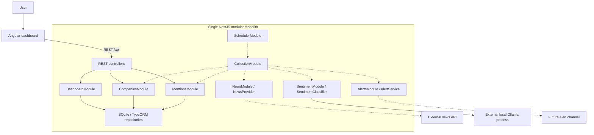
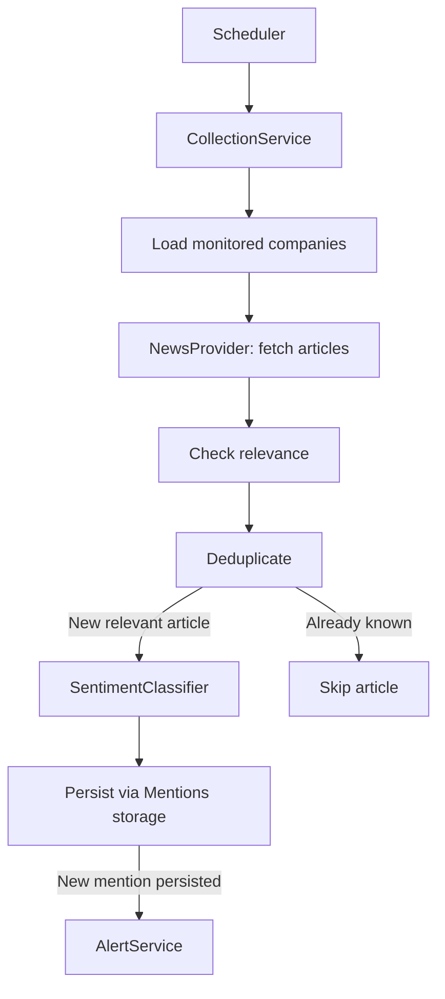
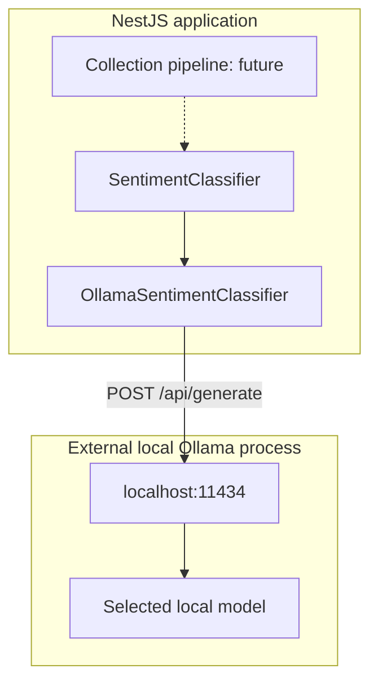

# Architecture

## Modular monolith

One NestJS application owns the REST API and all feature modules. Features collaborate in process; there are no microservices or distributed infrastructure. Angular and NestJS have independent build/watch processes in one simple npm workspace repository. The production NestJS process also serves the Angular static build.

## Feature ownership and current implementation

| Feature | Responsibility / current status |
| --- | --- |
| Companies | Company entity, feature repository/service, list and detail REST endpoints. Transactional source-of-truth seed import CLI with conservative exact identity matching. |
| Mentions | Mention entity, feature repository/service, read filters, existence check and internal persistence. Database uniqueness is authoritative. No external writes. |
| Dashboard | Specialized aggregate read repository, request-time derivation service and quarter-filtered REST endpoint. |
| News | Empty module; future NewsProvider with a real provider implementation. |
| Sentiment | SENTIMENT_CLASSIFIER contract/token, local Ollama adapter, strict response validation and isolated manual CLI. No automatic inference or database writes. |
| Collection | Empty module; future fetch/relevance/deduplicate/classify/persist orchestration. |
| Scheduler | Empty module; no scheduled jobs. |
| Alerts | Empty module; no delivery. |
| database | SQLite options, explicit versioned migration, standalone initialization command. |
| common | Concrete shared date, ID and DTO validation helpers. |
| config | Standard Nest ConfigModule .env loading shared by HTTP/CLI entry points, lazy runtime settings and feature-local Ollama configuration validation. |
| health | Process-liveness endpoint, not a dependency readiness check. |

The repository-root .env is loaded with @nestjs/config; existing process environment takes precedence. TypeORM/static serving factories run after configuration loading, so database/runtime settings also work in CLI contexts. Controllers validate HTTP DTOs. Feature services handle existence, range semantics, and meaningful domain errors. Feature repositories contain TypeORM queries. CompaniesService and MentionsService are exported for future collection use; DashboardRepository is a dedicated read projection with an aggregate query, not an orchestration service. There are no generic repository base classes or framework abstractions.

## SQLite persistence

SQLite with TypeORM and NestJS TypeORM integration provides a real relational database without an external database server. This is appropriate for a small, single-process take-home that should be easy to run. For a larger production system, PostgreSQL would likely be preferred for concurrent writers, operational tooling, and multiple application replicas. SQLite keeps this assignment self-contained.

DATABASE_PATH defaults to `data/press-monitor.db`. Relative paths resolve against the repository root, regardless of the current working directory. Absolute paths are supported. The parent directory is created automatically. Local database files are ignored by git.

`synchronize: false` is used in every mode. A versioned initial migration creates the tables, constraints and index transactionally. Pending migrations run on startup before requests are served; `npm run db:init` applies the same migrations without starting the application. TypeORM's migrations table records execution, making repeated initialization safe. This automatic startup approach is suitable for one take-home process; larger deployments would normally run migrations in a separate controlled release step. No seed data is inserted.

| Table | Fields and constraints |
| --- | --- |
| companies | id INTEGER auto-increment PK; name TEXT NOT NULL with non-blank check; domain TEXT NULL; sector TEXT NULL; createdAt and updatedAt DATETIME NOT NULL. |
| mentions | id INTEGER auto-increment PK; companyId INTEGER NOT NULL FK to companies with delete RESTRICT; title TEXT NOT NULL; description TEXT NULL; url TEXT NOT NULL; source TEXT NOT NULL; publishedAt DATETIME NOT NULL; sentiment TEXT NOT NULL restricted to POSITIVE/NEUTRAL/NEGATIVE; discoveredAt DATETIME NOT NULL. |
| migrations | TypeORM migration execution history, infrastructure only. |

`UNIQUE(companyId, url)` prevents duplicates for one company while allowing an article URL to mention multiple companies. The existence check is a convenience; the database constraint also protects racing inserts. Internal duplicate creation becomes a standard ConflictException. URL identity is exact stored text for now; URL normalization awaits the ingestion stage. An index on `(companyId, publishedAt)` supports company/time-range reads. Foreign keys are enabled by the SQLite driver and verified in tests.

There is no separate Article entity because the current scope only needs company-specific mentions. Additional normalization adds complexity without a current requirement.

## Derived dashboard data and date semantics

Dashboard statistics are read projections, not stored domain fields. A single left-joined aggregate query includes every tracked company, counts selected-quarter sentiments, and calculates MAX(publishedAt) across all time. The service computes elapsed whole days since that latest publication at request time. Future-dated publications yield zero rather than a negative day count. Companies with no mentions have null lastMentionedAt/null daysSinceLastMention and zero counts.

The default quarter uses the current UTC quarter. `YYYY-Q1` through `YYYY-Q4` are accepted with a four-digit, nonzero year. Quarter filters use `[start, nextQuarterStart)`, avoiding artificial end-of-day timestamps. Mention filters apply to publishedAt: date-only `from` means UTC midnight; date-only `to` includes that entire UTC day using the next midnight as an exclusive boundary. Timestamp inputs require a timezone; timestamp `to` is inclusive. Invalid calendar dates, invalid clock components, reversed ranges, invalid enums, unsafe/nonpositive IDs, repeated query values and unknown query parameters are rejected with 400. Missing companies return 404. Mentions are ordered by publishedAt descending then id descending.

## Frontend/backend and runtime modes

Angular remains a standalone title-only routed shell. No dashboard functionality, data requests, models, or fake data were added to the frontend. Future clients use relative `/api/...` URLs and ordinary services/component state.

Development: `npm run dev` runs Angular at http://localhost:4200 and NestJS at http://localhost:3000. Angular proxies `/api` and `/api/**` without rewriting the prefix. No CORS configuration is required for this proxied browser workflow. A changed PORT requires an updated proxy target. NestJS does not serve Angular during development.

Production: `npm run build` creates `frontend/dist/frontend/browser` and `backend/dist`. `npm run start` runs one NestJS process, with `/api/*` mapped to REST and other paths to Angular static files. Static serving is production-only, excludes `/api` and descendants, and falls back to the Angular index for extensionless non-API browser routes. Missing asset/API paths return 404. Startup fails if the frontend build is missing. Package both build directories preserving their relative layout, install runtime dependencies, and provide a writable durable database path. No SSR or separate frontend production process is used.

## Intended system architecture

Solid edges show implemented read/persistence dependencies; dashed edges describe future integration and orchestration. The core Companies, Mentions, Dashboard and storage components are now implemented. Everything inside the NestJS boundary remains one modular application.

## Future collection sequence (not implemented)

Deduplication is a pipeline step, not another module. Persistence belongs to the Mentions feature; alerts should follow newly persisted mentions only.

## Future integration points

| Integration | Boundary | Outstanding decisions |
| --- | --- | --- |
| News API | NewsProvider in NewsModule | Provider, credentials, rate limits, article identity and relevance policy. |
| Ollama | Implemented local SentimentClassifier adapter | Real local smoke test and quality evaluation; selected model remains configurable. |
| Storage | Companies/Mentions repositories | Add the actual company list and run the implemented conservative importer; domains remain optional. |
| Scheduler | SchedulerModule calls CollectionModule | Timezone, run time, overlap prevention and failure behavior. |
| Alert channel | AlertsModule | Console initially, delivery payload/failure handling, future external channels. |

## Company seed import

The developer adds the real dataset to `data/companies.json` and runs `npm run companies`. No data file is committed yet. CompanySeedService reads/parses/validates the complete file, then CompaniesRepository performs one transactional import. A CLI-only module loads configuration and SQLite, without the HTTP application or Ollama.

Names must be non-blank; optional domain/sector strings are trimmed and blank strings map to null. Domains are plain hostnames and normalized to lowercase. Source duplicates are rejected by exact normalized domain or case-insensitive trimmed name. Prefer a unique domain match, then a unique name; reject conflicting or ambiguous matches, non-empty domain reassignment by name, and two source rows targeting one existing company. Original identities are retained during the transaction so renamed aliases cannot be imported twice. A domain match may rename the display name. Omitted optional values preserve existing fields; explicit null/blank clears them. Counts report inserted/updated/unchanged. No deletion or fuzzy matching occurs. Any failure rolls back all writes. This is a single-import-at-a-time take-home workflow, without a concurrent importer framework.

## Local sentiment classification

Ollama is an external local process, not an application microservice. The adapter is an in-process provider behind the SENTIMENT_CLASSIFIER token. Its contract takes companyName/title/optional description and returns exactly the existing domain Sentiment enum. The sentiment CLI instantiates only SentimentModule, without SQLite, and is the real manual integration path. No REST endpoint or automatic database processing is added.

Configuration defaults: OLLAMA_BASE_URL=http://localhost:11434, OLLAMA_MODEL=gemma3:270m, OLLAMA_TIMEOUT_MS=60000. Loopback origins only; hosted URLs/cloud-tagged models/redirects are rejected. Disable cloud features in the separately running Ollama server using OLLAMA_NO_CLOUD=1 or its server settings. The app cannot configure an already-running server.

POST /api/generate sends a company-focused system prompt, JSON-encoded company/title/excerpt, stream=false and a JSON schema requiring only sentiment from POSITIVE/NEUTRAL/NEGATIVE. Options are temperature=0, seed=42 and num_predict=64. Inputs have explicit small character limits. Validate the completed HTTP envelope and parse/check the exact model object before returning the enum. No substring matching, fallback sentiment, model downloading, retry loop, or Ollama types outside the adapter.

Standard Nest exceptions represent input/configuration/connection/timeout/HTTP/output failures; CLI errors are concise and nonzero. No retries, including malformed responses. There is no schema change for technical failures. Unit tests mock fetch, never require Ollama, and do not prove model quality. A compact model is a reasonable initial choice for this constrained three-class task, but attribution/negation/mixed sentiment need later evaluation against real mentions and manual spot checks. Local end-to-end inference remains unverified here because Ollama is not installed/running.

## Deliberately deferred

No company seed data, news API, RSS, scraping, relevance logic, collection orchestration, scheduled jobs, alerts, real Angular dashboard, authentication, pagination, queues, Redis, CQRS, event bus, Docker or additional database service. Sentiment is only invoked manually or through its contract; there is no automatic database record processing. No external company or mention write endpoints exist.

## Assumptions and next stage

Company IDs are positive safe integers. Dates, quarter defaults and day calculations use UTC; day counts mean elapsed full 24-hour periods. URL uniqueness is exact text per company. Migrations run automatically in this single-process assignment. No company-name uniqueness is invented without the real source dataset.

Next: add the real company list, verify local Ollama and evaluate its output, then implement real news retrieval/relevance/deduplication, collection, scheduling/alerts and the dashboard in separate increments.

## References

- NestJS validation: https://docs.nestjs.com/techniques/validation
- TypeORM migrations: https://typeorm.io/docs/migrations/setup/
- SQLite driver: https://v0.typeorm.io/docs/drivers/sqlite/
- NestJS static serving: https://docs.nestjs.com/recipes/serve-static

- Ollama API: https://docs.ollama.com/api/generate
- Ollama local-only server: https://docs.ollama.com/faq#how-do-i-disable-ollama-cloud-features
